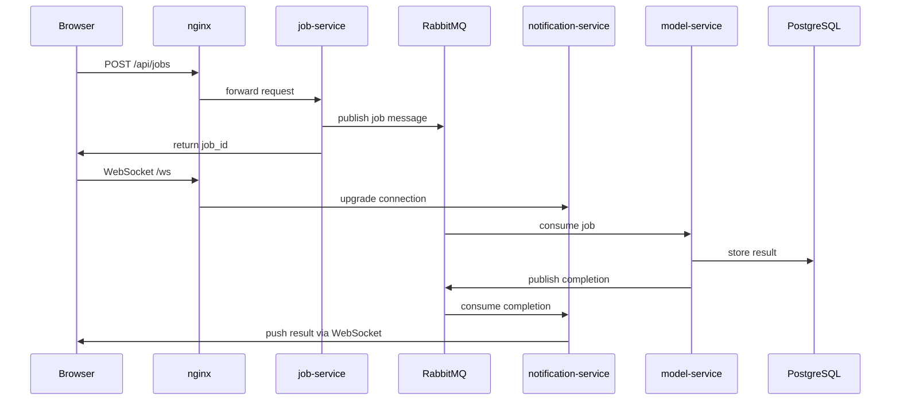

# textsummary
A full stack app that lets you summarize long texts.


## Architecture




## Service health and readiness

The backend services expose simple health and readiness endpoints to make service state observable and to support Docker Compose healthchecks.

### Health vs readiness

`/health` indicates that the service process is alive.

`/ready` indicates that the service can currently perform its role. Readiness may depend on required dependencies such as RabbitMQ, databases, caches, or other internal services.

For example, `job-service` can be alive while RabbitMQ is unavailable. In that case:

- `/health` should still return `200 OK`
- `/ready` should return `503 Service Unavailable`

This distinction avoids restarting healthy application processes just because an external dependency is temporarily unavailable.

### Current checks

| Service | Endpoint | Meaning |
|---|---|---|
| `job-service` | `/health` | FastAPI process is running |
| `job-service` | `/ready` | RabbitMQ connection/channel is usable |
| `notification-service` | `/health` | FastAPI process is running |
| `notification-service` | `/ready` | Service is ready; currently equivalent to health |
| `rabbitmq` | `rabbitmq-diagnostics ping` | RabbitMQ broker is running and responsive |

`model-service` is currently a worker process without an HTTP API. Its health/readiness behavior is planned separately. A future readiness check should verify that the model is loaded, RabbitMQ is connected, and the worker is consuming jobs.

### Docker Compose usage

Docker Compose uses healthchecks to determine whether selected services are healthy. These checks run inside the container being checked.

Example:

```yaml
job-service:
  healthcheck:
    test: ["CMD", "python", "-c", "import urllib.request; urllib.request.urlopen('http://localhost:8000/health')"]
    interval: 10s
    timeout: 5s
    retries: 5